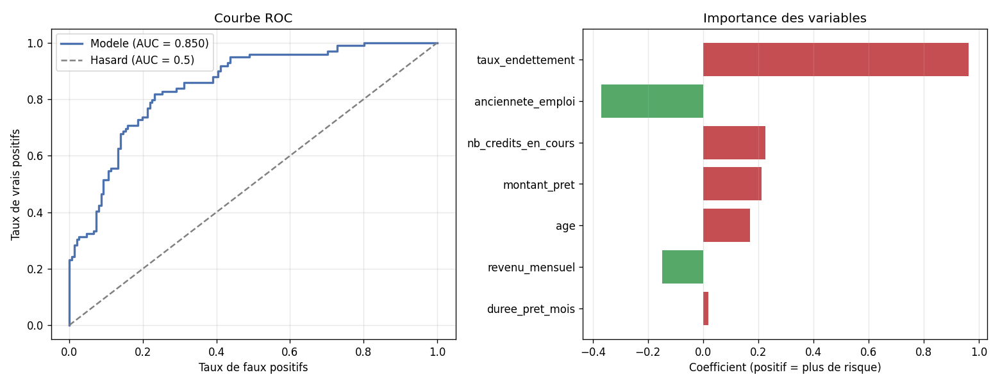

# Modèle de Credit Scoring

Un modèle Python qui estime la probabilité qu'un emprunteur fasse défaut sur son crédit. C'est l'outil central de décision des banques pour accorder ou refuser un prêt, et un domaine directement lié à l'analyse de crédit.

## Objectif

Le credit scoring consiste à évaluer le risque qu'un client ne rembourse pas son prêt. Le modèle apprend à partir d'un historique de clients dont on connaît déjà l'issue, puis prédit le risque pour de nouveaux emprunteurs. L'approche retenue est la régression logistique, standard du secteur bancaire, choisie pour sa robustesse et surtout son interprétabilité : on sait précisément pourquoi le modèle accorde ou refuse un crédit.

## Ce que fait le modèle

Le programme charge et prépare les données des clients, puis les sépare en un jeu d'entraînement et un jeu de test pour évaluer honnêtement la performance sur des clients jamais vus. Il entraîne ensuite une régression logistique, prédit la probabilité de défaut de chaque client, mesure la qualité des prédictions et identifie enfin les variables qui pèsent le plus dans la décision.

## Résultats

Sur le jeu de test, le modèle atteint une AUC de 0.85, ce qui indique une très bonne capacité à distinguer les bons des mauvais payeurs. L'analyse des coefficients confirme que le taux d'endettement est le facteur de risque le plus déterminant, suivi de l'ancienneté dans l'emploi et du nombre de crédits en cours, des résultats cohérents avec les pratiques réelles de l'analyse de risque en banque.



## Variables utilisées

Le modèle s'appuie sur sept variables décrivant chaque client : l'âge, le revenu mensuel, le montant du prêt, la durée du prêt, l'ancienneté dans l'emploi, le nombre de crédits en cours et le taux d'endettement. Ce dernier, qui mesure la part du revenu absorbée par la mensualité, est l'un des indicateurs les plus surveillés en banque.

## Technologies

Python 3, avec scikit-learn pour la modélisation, pandas pour la manipulation des données, NumPy pour les calculs et Matplotlib pour la visualisation.

## Comment lancer

```
pip install scikit-learn pandas numpy matplotlib
python credit_scoring.py
```

Le programme affiche les résultats en console et génère l'image credit_scoring_resultats.png.

## Note sur les données

Les données clients sont générées de façon réaliste et reproductible au sein du programme, afin que le modèle puisse être exécuté par n'importe qui sans recourir à des données bancaires confidentielles. La structure du code reste directement applicable à un vrai fichier de clients.

## Concepts appliqués

Régression logistique, séparation entraînement/test, standardisation des variables, matrice de confusion, courbe ROC et AUC, interprétation des coefficients comme facteurs de risque.

Projet réalisé dans le cadre de mon parcours en Finance (M1, ENCG Fès).

